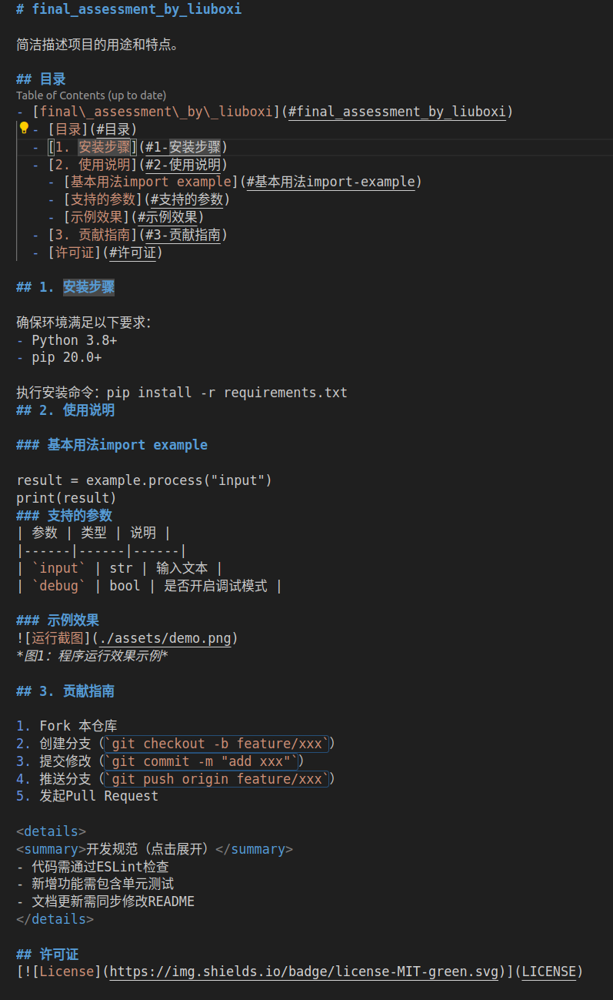

# final_assessment_by_liuboxi

我想放假

## 目录
- [final\_assessment\_by\_liuboxi](#final_assessment_by_liuboxi)
  - [目录](#目录)
  - [1. 任务理解](#1-任务理解)
  - [2. 实现思路](#2-实现思路)
  - [3. 数据处理](#3-数据处理)
  - [4. 数学原理](#4-数学原理)
  - [5. 代码框架解释](#5-代码框架解释)
  - [6. AI编写部分](#6-ai编写部分)
  - [7. 运行说明](#7-运行说明)
  - [8. 可复现性说明](#8-可复现性说明)
## 1. 任务理解
两个节点包分别创建一个topic，用于发布相机参数和传感其数据，构建另一个节点包，通过topic订阅数据，并在其中调用构建好的pnp_solve和kf_solve功能包对数据进行数学处理以获得更精确稳定的数据，最后将两次数学运算的数据通过两个新的topic发布以便于通过foxglove图表产生滤波效果图

## 2. 实现思路
- [image](image)
  用于存储README中需要用到的图片
- [ros_ws](ros_ws)
  - [armor_interface](ros_ws/src/armor_interface)
  自定义了两个ArmorPoint和ArmorPose两个消息类型，该包作为接口包以备其他包调用
  - [bringup](ros_ws/src/bringup)
  一个launch和config包，用于方便启动和调参，该包采用了ament_python构建
  其中
    - [launch](ros_ws/src/bringup/launch)
    将config里的yaml传递到源码中（但根据笔者的调试过程，传参失败的情况问题大部分还是在其他包里）
    节点运行顺序：camera_publisher与armor_pose_solver一同运行，一秒后armor_publisher运行（原先目的是为了防止armor_pose_solverl漏掉arnor_publisher发布的头几个数据，但现在看来它更大的用途是通过一秒的间隔时间看到armor_pose_solver的日志打印以确定参数是否正确传递）
    - [config](ros_ws/src/bringup/config)
      - [correct_camera_info.yaml](ros_ws/src/bringup/config/correct_camera_info.yaml)
      题目提供，主要获取相机内参和畸变系数
      - [data.csv](ros_ws/src/bringup/config/data.csv)
      题目提供，传感器参数文件
      - [kalman.yaml](ros_ws/src/bringup/config/kalman.yaml)
      卡尔曼参数文件 ，设置了时间步长dt，状态协方差矩阵P_,过程噪声Q_(位置，速度，偏航角和偏航角速度)以及测量噪声R_(x,y,z,yaw)
  - [kf_solve](ros_ws/src/kf_solve)
    卡尔曼滤波功能包，使用KF滤波器对数据进行处理，笔者也曾使用EKF滤波器对数据进行处理，但相同参数下滤波效果并没有KF滤波器的好
  - [pnp_solve](ros_ws/src/pnp_solve)
    PNP解算功能包，使用`cv::SOLVEPNP_IPPE_SQUARE`进行处理
  - [publisher_armor](ros_ws/src/publisher_armor)
    节点包，创建`armor_parameters_publisher`节点，创建topic`armor_parameters`,创建发布者读取发布`data.csv`文件，发布频率为10ms一条（循环发布）
  - [publisher_camera](ros_ws/src/publisher_camera)
    节点包，创建`camera_parameters_publisher`节点，创建topic`camera_parameters`,创建发布者读取发布`correct_camera_info.yaml`文件，发布频率为1s一次
  - [subscriber](ros_ws/src/subscriber)
    节点包，创建`armor_pose_solver`节点，通过topic`camera_parameters`,`armor_parameters`，创建订阅者获取相机参数和传感器数据,调用`pnp_solve`和`kf_solve`功能包，再创建topic`armor/raw_pose``armor/filtered_pose`将解算数据与滤波数据发布供foxglove对比画图（未设定定时器，算出数据就发布）
## 3. 数据处理
1. pnp_solve
    `cv::SOLVEPNP_IPPE_SQUARE`
    需要的参数：传入的图像坐标系下的 2D 点与装甲板的长宽构成的物体坐标系下的 3D 点，畸变函数与相机内参
    获得旋转向量和平移向量，平移向量用于计算相机坐标系的（x，y，z）旋转向量通过欧拉角等变换成(pitch, yaw, roll)
2. kalman_solve
   卡尔曼滤波的初始状态值的前四维将第一次传入的数据作为初始值（x，y，z，yaw），后四维设置为0（前四维对应的速度），后续采用匀速模型进行线性滤波迭代

## 4. 数学原理

预测：

$$ x_{k|k-1} = F * x_{k-1|k-1} $$

$$ P_{k|k-1} = F * P_{k-1|k-1}* F^T + Q $$

更新:

$$ K = P_{k|k-1} * H^T * (H * P_{k|k-1} * H^T + R)^{-1} $$

$$ x_{k|k} = x_{k|k-1} + K * (z_k - H * x_{k|k-1}) $$

$$ P_{k|k} = (I - K * H) * P_{k|k-1} $$

## 5. 代码框架解释
本意是一个节点包，下面包含全部的节点创建文件，两个功能包，一个参数接口包和一个launch包，但想出规整的框架前publisher_armor包已写完,故而节点包拆成三个包来写
## 6. AI编写部分

1. 为了md在github上的可读性，ai编写了一个markdown的框架，主体内容完全改动，学习到了md目录的使用便捷性
引用前md文档图：

2. `ros_ws/src/node_publisher_armor/msg/ArmorPoints.msg`文件为ai编写
3. `node_publisher_armor/CmakeLists.txt`以及`node_publisher_armor/package.xml`中的关于`rosidl`用法为ai编写
4. 现在除了md和camera_publisher，还有我写的部分吗QAQ

## 7. 运行说明
`colcon build --cmake-args -DCMAKE_EXPORT_COMPILE_COMMANDS=ON`(clang报错时适用)
`source install/setup.bash`
另开一个终端
`source install/setup.bash`
`ros2 launch foxglove_bridge foxglove_bridge_launch.xml`
## 8. 可复现性说明
卡尔曼滤波的参数通过config中的`kalman.yaml`调整，通过图像对比希望维度的某个数据更平缓就减小Q或增大R，希望数据更贴近观测数据就增大Q或减小R

